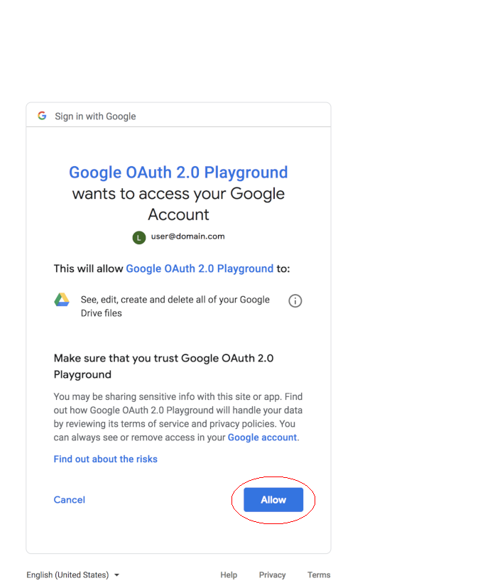
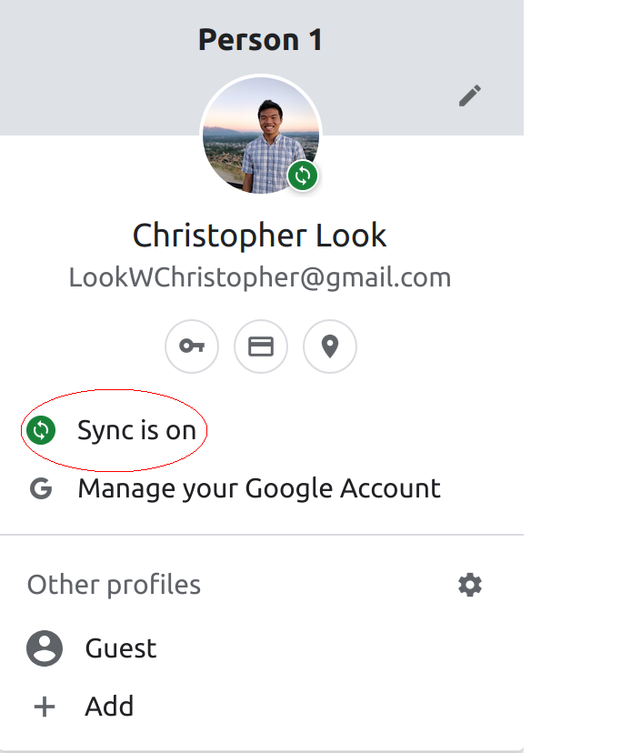

### Video Call Calendar Auto Call Extension

Do you spend 10 minutes before a meeting, making sure that you don't miss that meeting? Do you struggle to stay in the flow right before those meetings? Well I do. I created this chrome that will call the you when your meeting starts by opening your google meet meetings with a ringtone. Now, you can concentrate on coding, product managing, data sciencing, or whatever, up until right before your meeting. 

## How to use

1. Install the extension
2. a popup should come up, press allow

3. Make sure sync is enabled in your browser. Chrome for some reason won't give me your email address without it :(

